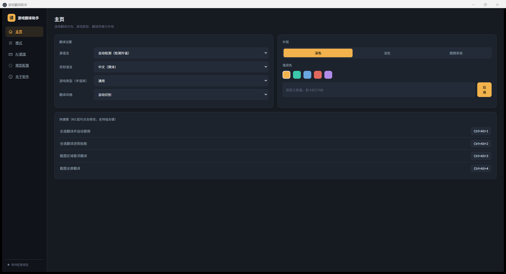
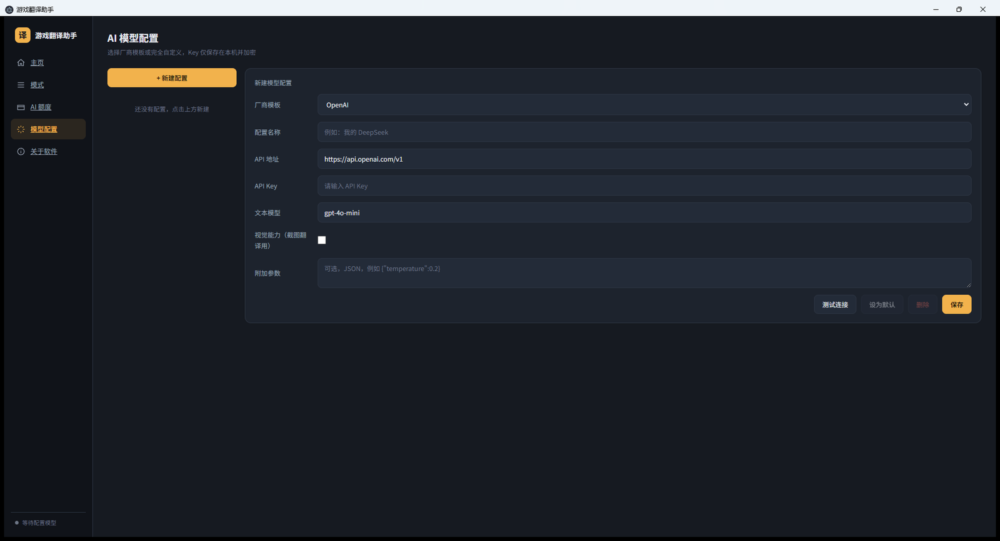
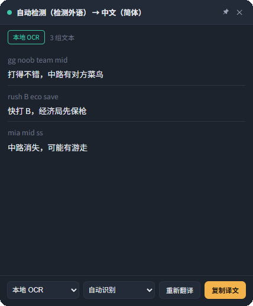

# 🎮 游戏翻译助手 GameTranslator

> ✨ 为外服开黑打造的 Windows 桌面实时翻译工具：框选截图 → OCR / 视觉识别 → 大模型翻译 → 译文直接回到游戏里。

<div align="center">
  
  <br><br>
  <a href="#"></a>
  <a href="#"></a>
  <a href="#"></a>
  <a href="#"></a>
  <a href="#"></a>
</div>

---

## 🖼️ 功能预览

**主页 · 翻译工作台** —— 语言方向、术语库、翻译风格与全局快捷键，一页管理：

<div align="center"></div>

**AI 模型配置** —— 厂商模板一键填好接口地址，密钥加密存本机：

<div align="center"></div>

**悬浮翻译窗** —— 画面识别结果以半透明悬浮窗叠加在游戏之上，原文译文对照，一键复制：

<div align="center"></div>

---

## 📝 项目简介

游戏翻译助手是一款 Windows 桌面端的游戏实时翻译工具，解决外服开黑时「看不懂、说不出」的问题：截取游戏画面 → OCR / 视觉识别外文 → 调用你自己配置的大模型翻译成母语 → 以悬浮窗叠加回画面；在聊天框里按下快捷键，译文还能直接替换原文，全程不用切出游戏。

当前版本 **v1.0.0**（游戏翻译助手首个正式版本），安装包 `game-translator-1.0.0-setup.exe`（NSIS，Windows x64，131.9 MB）。

### ✨ 主要特性

- 🚀 **实时翻译**：全局热键触发截图，OCR 识别后调用大模型翻译，结果以悬浮窗叠加显示
- 👁️ **OCR 引擎**：本地引擎 / 视觉大模型 / 混合模式三选一，可在设置里切换
- 📚 **术语库**：内置通用、Dota2、LOL、PUBG、CS2 术语库，支持自定义与在线更新
- 🎭 **翻译风格**：日常 / 专业 / 嘴臭三档，嘴臭档另有火力等级
- 💬 **常用语**：多页游戏话术，一键发送，可配置「发送前翻译」「自动回车」
- 📊 **AI 额度**：统计各模型的调用量与配额消耗
- 🧩 **模型配置**：自定义模型厂商、接口地址与密钥（密钥用 Windows DPAPI 加密存本机）
- ☁️ **账号同步**：术语库、常用语等配置可保存到云端，在多台机器间同步
- 🔄 **检查更新**：软件内读取官网版本清单，发现新版本时给出更新说明并引导下载

> **API 配置上云是默认关闭的。** 打开后密钥会以明文离开本机，界面上有明确的免责声明与二次确认。

---

## 🎯 使用场景

- **外服开黑看不懂队友报点**：聊天框里按 `Ctrl + Alt + 1`，外文原文直接被替换成中文译文，回车就发出去
- **满屏任务提示、结算面板、剧情字幕**：按 `Ctrl + Alt + 4` 全屏截图翻译，悬浮窗直接叠在画面上
- **看不懂装备、技能、地图标记**：按 `Ctrl + Alt + 3` 框选局部识别，配合术语库，英雄名和黑话不再乱翻
- **想用中文跟外国队友交流**：常用语多页话术一键发送，可选「发送前翻译」和「自动回车」

---

## 🚀 快速开始

1. **下载**：从[官网首页](https://game-translator.app.workbuddy.host/)的下载按钮获取安装包，或前往 [GitHub Releases](https://github.com/ffffyin/game-translator/releases) 下载
2. **安装**：双击 `game-translator-1.0.0-setup.exe`，按向导完成安装，可自定义安装目录并创建桌面与开始菜单快捷方式
3. **注册 / 登录**：没有账号就点「注册新账号」（昵称 + 邮箱 + 验证码 + 密码，6~60 位）；已有账号用邮箱和密码登录
4. **配置模型**：到「AI 模型配置」选厂商模板（OpenAI 兼容 / DeepSeek / 通义 / 智谱 / Kimi / OpenRouter），填 API Key、接口地址与模型名，点「测试连接」验证并设为默认
5. **开始使用**：回主页选择语言方向、游戏术语库、翻译风格与截图识别通道，进游戏按快捷键即可

> 安装包未做代码签名，首次运行时 Windows SmartScreen 可能提示「Windows 已保护你的电脑」：点击「更多信息 → 仍要运行」即可正常安装，同一台机器再次安装不会再出现该提示。

> 软件内「关于软件 → 检查软件更新」会读取官网的版本清单，发现新版本时会给出更新说明并引导前往下载。

---

## 🔐 登录与联网说明

- 软件**必须登录才能使用**，账号用邮箱注册，密码自设（昵称仅用于界面展示，不能用来登录或找回账号）。
- **每次启动都需要重新登录。** 这是作者有意为之的设计，不是缺陷。
- **离线状态下打不开软件**，登录需要联网完成云端验证。
- 若想省事，登录页可勾选「保存密码」和「自动登录」：
  - 密码经 Windows 凭据加密（DPAPI）保存在本机，换电脑或换系统后无法读取；
  - 开启自动登录后，每次启动会用保存的密码联网自动登录，**自动登录失败（含断网）仍会回到登录页**。
- 退出登录或修改密码，都会清除本机保存的密码并关闭自动登录。

---

## ⌨️ 默认快捷键

| 快捷键 | 功能 |
| --- | --- |
| `Ctrl + Alt + 1` | 全选 → 翻译 → 自动替换原文（在游戏聊天框里按下，译文直接替换掉原文） |
| `Ctrl + Alt + 2` | 全选 → 翻译 → 译文进剪贴板（原文不动，自己决定要不要发） |
| `Ctrl + Alt + 3` | 框选截图 → 识别翻译 → 悬浮窗（`ESC` 取消框选） |
| `Ctrl + Alt + 4` | 全屏截图 → 识别翻译 → 悬浮窗（适合任务提示、结算面板与剧情字幕） |
| `Alt + 1` ~ `Alt + 8` | 发送当前话术页的对应常用语 |
| `ESC` | 取消框选，不发起任何请求 |

> 键位可在主页点击右侧按键徽章修改，支持 Ctrl / Alt / Shift 组合键，改完立即生效；系统拒绝注册某个组合键时会自动回滚并恢复原键位。主窗口处于前台时按 `Ctrl + Alt + 1 / 2` 会提示「请切到游戏内聊天框」，避免误触。

---

## 💡 使用技巧

- **游戏建议用无边框窗口模式**：独占全屏模式下可能截图黑屏或快捷键失效，把游戏改成无边框窗口即可解决。
- **识别不准时换通道**：本地 OCR（中英文）对极小字号 / 艺术字识别有限，可切换 AI 视觉通道（更准、消耗额度），或选「本地 + AI」组合模式 —— 本地 OCR 优先，失败自动改用 AI 视觉。
- **把黑话喂进术语库**：到「模式」页补充常遇到的词条（支持导入导出与联网更新），专有名词的准确度会明显提升。
- **换电脑迁移配置**：旧机器「账号同步」页点「保存到云端」，新机器登录同一邮箱后点「从云端恢复」。同步是整包覆盖、不做逐条合并，恢复前会在本机自动留一份备份。
- **数据与卸载**：数据存放在本机 `%APPDATA%\GameTranslator\`，卸载默认保留数据目录，重装后自动恢复原有配置。

---

## 🔒 隐私说明

- **配置数据默认只存本机**：设置、模型配置、术语库、常用语、快捷键与用量日志都写在本机 `%APPDATA%\GameTranslator\` 下的 SQLite 数据库里，没有账号服务器保存你的翻译内容。
- **API Key 加密存储**：密钥用 Windows DPAPI 加密后落盘，数据库里看不到明文，更换 Windows 账号无法解密。「API 配置上云」默认关闭，打开后密钥会以明文离开本机。
- **翻译请求只发往你配置的厂商**：翻译与视觉识别时，被识别的文字 / 截图会发到你在「AI 模型配置」里填写的接口地址（如 DeepSeek、OpenAI 兼容地址或自建中转站），软件不中转、不记录原文。
- **登录凭据本机加密**：登录标识是邮箱，登录凭据用 DPAPI 加密存为本机文件，退出登录即删除。

---

## 🛠️ 技术栈

| 模块 | 技术 |
| --- | --- |
| 桌面框架 | Electron 44 |
| 界面 | Vue 3 + Pinia + vue-router |
| 语言 | TypeScript |
| 本地存储 | better-sqlite3（SQLite） |
| 本地 OCR | tesseract.js |
| 测试 | vitest |

---

## 👨‍💻 开发指南

### 环境要求

- Node.js 18 及以上版本
- Windows 10 / 11（打包 Windows 安装包需要）

### 安装依赖

```bash
git clone https://github.com/ffffyin/game-translator.git
cd game-translator
npm install
```

### 开发命令

```bash
npm run dev            # 开发模式
```

### 打包与校验命令

```bash
npm run build:win      # 打包 Windows 安装包
npm test               # 全量测试
npm run typecheck:node # 主进程类型检查
npm run typecheck:web  # 渲染层类型检查
```

---

## 🤝 贡献指南

欢迎通过 [Issues](https://github.com/ffffyin/game-translator/issues) 反馈使用问题与功能建议；提交 PR 前请先跑通 `npm test` 与两份类型检查。

---

## 📜 开源协议

本项目基于 [MIT 协议](LICENSE) 开源。

- 源码中的云端 `publishableKey` 是可公开的前端标识（等价于可被任意客户端抓取的公开配置），不是密钥。
- 本项目源码公开用于备份与展示，软件版权归作者所有。

---

<div align="center">

用 ❤️ 为外服开黑玩家打造

**游戏翻译助手 GameTranslator** · 作者 **fygod**

[GitHub](https://github.com/ffffyin) · QQ 316606176 · [官方网站](https://game-translator.app.workbuddy.host/)

</div>
